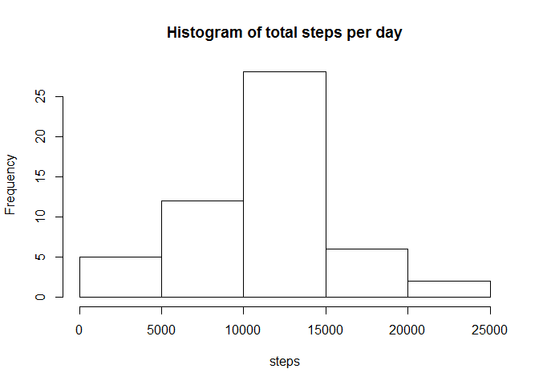

## Loading and preprocessing the data
Load libraries first (warnings are hidden)

```r
library(dplyr)
library(ggplot2)
library(nnet)
library(timeDate)
```

Create folder figures to add graph files

```r
if (!file.exists("figures")){
   dir.create("figures")
}
```

Load data

```r
if (!file.exists("activity.csv")){
   unzip("activity.zip")
}
activityWithNA <- read.csv("activity.csv")

##preproces by adding new variable datetime (string format)
activityWithNA[,4]<-paste(activityWithNA[,2],activityWithNA[,3])

##remove NA values
activity <- activityWithNA[!is.na(activityWithNA$steps),]
```

## What is mean total number of steps taken per day?

```r
averagesPerDay <- aggregate(activity$steps, list(activity$date), sum)
names(averagesPerDay)<-c("date","steps")
hist(averagesPerDay[,2], xlab="steps", main="Histogram of total steps per day")
```

<!-- -->

```r
dev.copy(png,"./figures/totalStepsPerDay1.png")
```

```
## png 
##   3
```

The mean of average daily steps is: 

```r
mean(averagesPerDay[,2])
```

```
## [1] 10766.19
```

The median of average daily steps is: 

```r
median(averagesPerDay[,2])
```

```
## [1] 10765
```

## What is the average daily activity pattern?
Show the mean amount op steps per interval. Intervals are 5 minute intervals from 00:00 (0000) to 23:55 (2355).

```r
averagesPerInterval <- aggregate(activity$steps, list(activity$interval), mean)
names(averagesPerInterval)<-c("interval","steps")
ggplot(averagesPerInterval,aes(x=interval,y=steps))+geom_line()
```

<!-- -->

```r
ggsave("./figures/averageDailyActivity.png")
```

```
## Saving 7 x 5 in image
```

At the following interval time there are on avarage the most amount of steps:

```r
averagesPerInterval[which.is.max(averagesPerInterval$steps),1]
```

```
## [1] 835
```

## Imputing missing values
1. Calculate and report the total number of missing values in the dataset (i.e. the total number of rows with NAs)

```r
sum(is.na(activityWithNA$steps))
```

```
## [1] 2304
```

2. Devise a strategy for filling in all of the missing values in the dataset. The strategy does not need to be sophisticated. For example, you could use the mean/median for that day, or the mean for that 5-minute interval, etc.  
  
Using interval mean to substitute NA's of that particular interval.

```r
intervalsWithNA <- activityWithNA[is.na(activityWithNA$steps),] #filter NA's
fillNA <- merge(intervalsWithNA,averagesPerInterval,by.x="interval", by.y="interval")#merge tables on interval
fillNA <- arrange(fillNA,date,interval)                                              #restore original order 
```

```
## Warning: package 'bindrcpp' was built under R version 3.4.2
```

3. Create a new dataset that is equal to the original dataset but with the missing data filled in.

```r
activityNAMeaned <- activityWithNA #create new dataset
activityNAMeaned[is.na(activityWithNA$steps),1]<- fillNA[,5] #substitute only the NA's with interval means
```

4. Make a histogram of the total number of steps taken each day and Calculate and report the mean and median total number of steps taken per day. 

```r
averagesPerDayNAMeaned <- aggregate(activityNAMeaned$steps, list(activityNAMeaned$date), sum)
names(averagesPerDayNAMeaned)<-c("date","steps")
hist(averagesPerDayNAMeaned$steps, xlab="steps", main="Histogram of total steps per day (NA's substituted)")
```

<!-- -->

```r
dev.copy(png,"./figures/totalStepsPerDay2NaSubst.png")
```

```
## png 
##   4
```

The mean of average daily steps is: 

```r
mean(averagesPerDayNAMeaned$steps)
```

```
## [1] 10766.19
```

The median of average daily steps is: 

```r
median(averagesPerDayNAMeaned$steps)
```

```
## [1] 10766.19
```

Do these values differ from the estimates from the first part of the assignment?  
Answer: the mean did not shift, the median became a bit higher than before. 

What is the impact of imputing missing data on the estimates of the total daily number of steps?  
Answer: median shifted and the histogram values in general are a bit higher on the whole range (because NA's are now also counted)

Are there differences in activity?  
Answer: the activityPatern for average amount of steps per interval did not change, as we filled the NA's of each interval with the mean of that interval. The mean therefore did not change. This also the explanation why only the median shifted and not the mean. The Activity graph is the same as before:


```r
averagesPerIntervalNAMeaned <- aggregate(activityNAMeaned$steps, list(activityNAMeaned$interval), mean)
names(averagesPerIntervalNAMeaned)<-c("interval","steps")
ggplot(averagesPerIntervalNAMeaned,aes(x=interval,y=steps))+geom_line(color="blue")+ggtitle("Mean amount of steps per interval (after substituting NA's)")
```

<!-- -->

```r
ggsave("./figures/averageDailyActivity2NaSubst.png")
```

```
## Saving 7 x 5 in image
```

Are there differences in activity patterns between weekdays and weekends?  
Add new variable to dataset determining if it a weekday or weekend. 

```r
activityNAMeaned<-mutate(activityNAMeaned,isWeekend=factor(ifelse(isWeekend(activityNAMeaned$date),"Weekend","Weekday")))

averagesPerIntervalNAMeaned <- aggregate(activityNAMeaned$steps, by=list(activityNAMeaned$interval, activityNAMeaned$isWeekend), FUN=mean)

names(averagesPerIntervalNAMeaned)<-c("interval","isWeekend","meanSteps")

plot <- ggplot(averagesPerIntervalNAMeaned,aes(x=interval,y=meanSteps))+geom_line()
plot+ggtitle("Average amount of steps per interval (Weekday vs Weekend)")+facet_wrap(~isWeekend, ncol=1)
```

<!-- -->

```r
ggsave("./figures/averageDailyActivityWeekendWeekDay.png")
```

```
## Saving 7 x 5 in image
```
  
The graphs show that there is more activity during weekdays in the morning hours (maybe walking to work, instead of staying in bed). There is also more activity in the weekdays at about 18:00 hours (maybe coming home from work).   
The activity during the weekend is in general a bit more active during the day (maybe daytime activities instead of sitting in the office).  
  
All graphs where saved in figures folder  
  
The end
